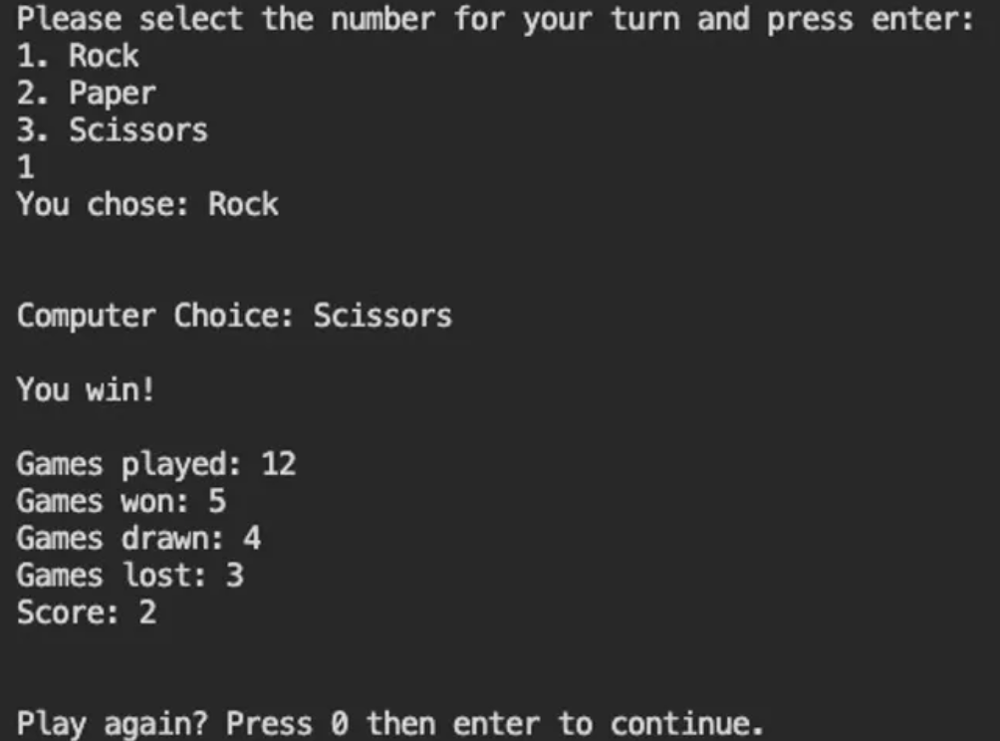
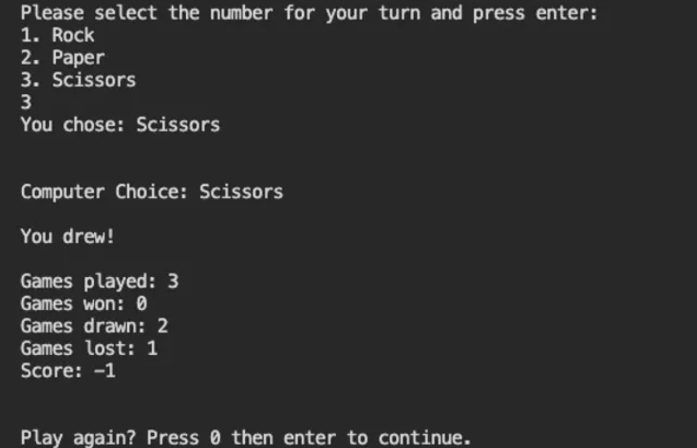
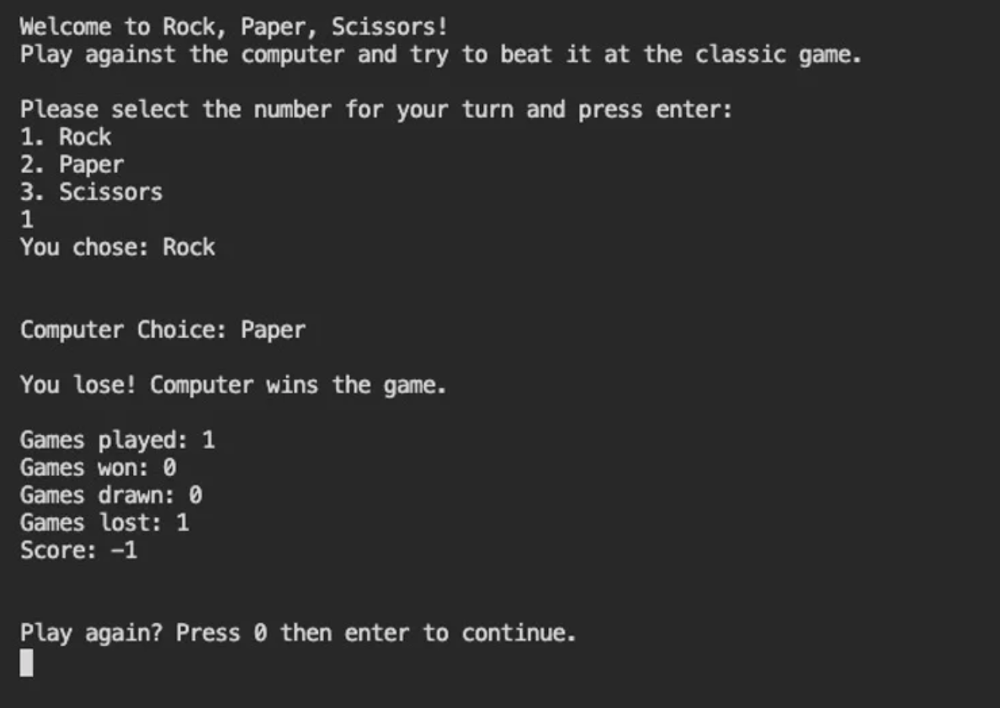

# ROCK, PAPER, SCISSORS

## Classic Game Written in C++

### Laura Ashcroft

<table>
<td></td>
<td></td>
<td></td>
</table>

###

The classic Rock, Paper, Scissors game written in C++

###This game demonstrates:

- Assigning variables as strings to easily reuse certain words/phrases - reducing repetition across the code

- Breaking code down into small, specific functions to clean up the file

- Using std::cout and std::cin to create a dynamic game where the player can input their choices and receive messages

- Using a switch statement to set conditions for specific cases dependent on what the player has entered into the game

- Using a for loop to generate a random number for the computer between 1 and 3 and assign them to 'rock', 'paper' or 'scissors'

- Creating a series of if/else if statements to determine if the game has been won, lost or drawn

- Increasing an integer variable by 1 each time a certain condition is met

- Displaying the games played, won, lost, drawn and the game score at the end of each round

- Creating a loop where the player decides if they want to continue or end the game

## How to use

1. Read the introduction to set the scene of the game.
2. Enter your choice of rock, paper or scissors into the terminal.
3. The computer will randomly generate their choice.
4. See who wins!
5. Continue playing for as long as you want to see your score build up!

## Installation

1. Clone or download this repository.
2. Compile the file by entering 'g++ main.cpp' into the terminal
3. Execute the file by entering './a.out' into the terminal
4. The game will start!
